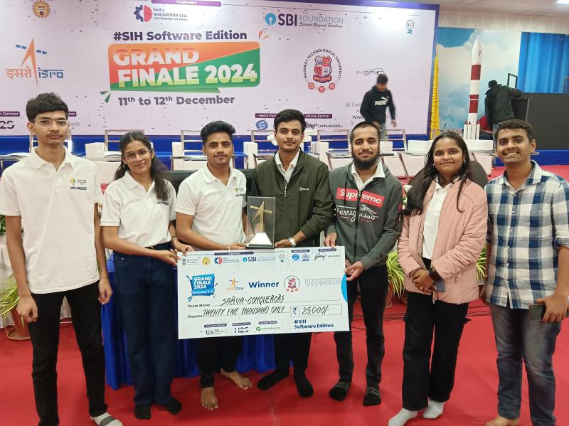

# 🎯 Fusion Net – Our SIH 2024 Winning Solution

A deep learning-based solution developed during **Smart India Hackathon 2024** under the problem statement by **ISRO**, focused on **SAR Image Colorization** using a hybrid attention-based model.

---

## 🚀 Problem Statement

> Convert grayscale **SAR (Synthetic Aperture Radar)** images into realistic, optical-like color images using deep learning to aid in better visual interpretation.

---

## 🏆 Recognition

  
   
  <em>Team Sarva-Conquerors</em>

---

## 👤 Target Users

- ISRO, DRDO, and space research orgs  
- Disaster management teams  
- Remote sensing analysts  
- Environmental & agricultural agencies  
- Urban & infrastructure planners  

---

## 🧠 Solution Overview

We developed a **Hybrid Model with Attention Mechanisms**:
- Dual-branch encoder-decoder architecture
- Attention for refining SAR–optical features
- Trained using RISAT & Sentinel-1 datasets
- Results evaluated with **PSNR, SSIM, SAM**

---

## 🧪 Key Results

| Metric | Value |
|--------|-------|
| PSNR   | 30.0  |
| SSIM   | 0.90  |
| SAM    | 0.50  |

✅ Trained on 200+ image pairs
📈 30–50 Epochs  
📦 LOC: ~1000 lines  

---

## 🌐 Web Interface

Includes:
- Image upload for SAR testing
- Real-time inference
- Download colorized outputs

> Built with **Python**, **Flask**, and minimal **HTML/CSS**

---

## 💡 Features

- SAR-to-Optical image transformation  
- Deep learning + attention-based architecture  
- Easy-to-use web interface  

---

## 👨‍💻 Team Sarva-Conquerors

- 🧠 Krushna Thakare (Team Leader)  
- 🧠 Sujal Lokhande
- 🧠 Vaidehi Upankar
- 🧠 Pratik Dhaktode  
- 🧠 Suhani Bighane  
- 🧠 Hussain Raja  
- 🧑‍🏫 Jatin Vishwakarma (Team Mentor(SIH'24 Mentor))

---

## 🛠 Tech Stack

- Python, Flask  
- TensorFlow, PyTorch  
- HTML/CSS for frontend  
- RISAT & Sentinel datasets  

---

## 🌟 Show Some Love

If you like this project, consider giving it a ⭐  
It motivates us to keep building impactful tech!

